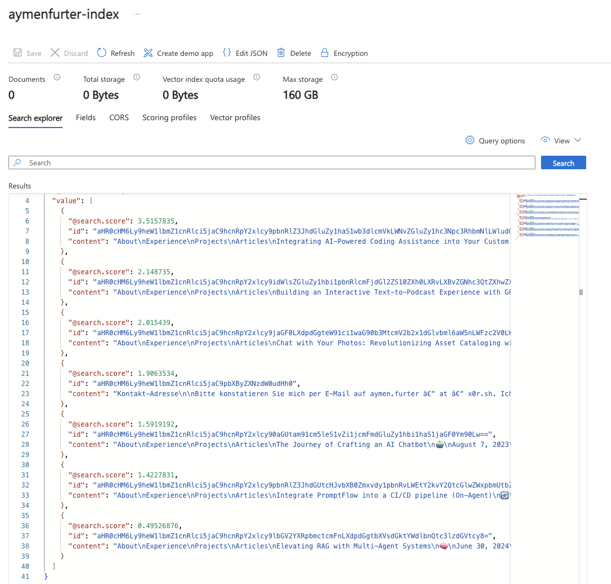

# AI Search Web Crawler

A demo project showing how to use LlamaIndex together with Azure AI Search to index a website's content.

## Overview

This project demonstrates how to:
- Crawl websites using LlamaIndex's WholeSiteReader
- Generate vector embeddings for text using Azure OpenAI
- Create and populate an Azure AI Search index with vector search capabilities

## Prerequisites

- An Azure subscription
- Azure AI Search resource
- Azure OpenAI resource with an embedding model deployment

## Setup

1. Clone this repository
2. Create a `.env` file with the following variables:
```
AZURE_SEARCH_ENDPOINT=your_search_endpoint
AZURE_SEARCH_API_KEY=your_search_api_key
AZURE_SEARCH_INDEX_NAME=your_index_name
AZURE_OPENAI_ENDPOINT=your_openai_endpoint
AZURE_OPENAI_API_KEY=your_openai_api_key
AZURE_OPENAI_MODEL=your_embedding_model_deployment_name
AZURE_OPENAI_API_VERSION=2023-05-15
```
3. Install the required dependencies:
```bash
pip install -r requirements.txt
```

## Usage

Run the web crawler with:

```bash
python main.py
```

The crawler will index the example website (aymenfurter.ch). To crawl your own website, modify the `base_url` and `prefix` parameters in the `main.py` file.

## Results

After running the crawler, you can see the indexed documents in your Azure AI Search resource:



## Customization

- Adjust the `max_depth` parameter to control how deeply the crawler traverses links